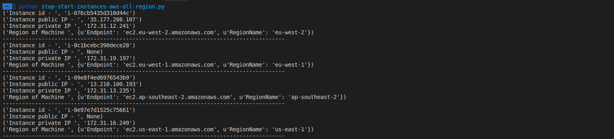

# Start/Stop Instances with Lambda AWS Across All Regions 


We want reduce costs in our AWS account. We will use the following hours:

Starting at Morning
--> 05:10:00 GMT

Shutdown At Night
--> 20:10:00 GMT

You can modify all content in lambda.tf file. 
Your boss Finance will appreciate it ;-)


# Technologies we’ll use:

*  EC2 (compute instances)
*  Lambda (compute service that lets you run code without worrying about servers)
*  CloudWatch (monitoring service for AWS)
*  Finally IAM (Identity and Access Management, control security access)


```bash
apt-get install terraform (Google)
```


* Terraform Version == v0.11.3
* S.O == Ubuntu Xenial 16.04.4 LTS


# Steps before deploy:
1º Tag your instance/instances

```bash
Status save_money
```


2º Create your ZIP 

```bash
terraform apply --target data.archive_file.cost_savings_zip
```

# Deploy:

```bash
terraform plan
terraform apply

```


# Testing

If everything is working well, we will see CloudWatch :


```bash

https://XXX.console.aws.amazon.com/cloudwatch/

Logs/Output

1ºStart_cost_savings

Starting instance: ec2.Instance(id='i-0c1bcebc690dece28')
('Instance id - ', 'i-0a8822ebd6944d78d')
('Instance public IP - ', '34.230.70.100')
('Instance private IP ', '172.31.30.195')
('Region of Machine ', {u'Endpoint': 'ec2.us-east-1.amazonaws.com', u'RegionName': 'us-east-1'})

2ºStop_cost_savings

Stopping instance: ec2.Instance(id='i-0c1bcebc690dece28')
('Instance id - ', 'i-0a8822ebd6944d78d')
('Instance public IP - ', '34.230.70.101')
('Instance private IP ', '172.31.30.195')
('Region of Machine ', {u'Endpoint': 'ec2.us-east-1.amazonaws.com', u'RegionName': 'us-east-1'}) 


```

# Example some Regions AWS





# Licence

MIT

# Information

More info --> 

https://aws.amazon.com/lambda/

https://www.thinkforwardmedia.com/automating-ec2-instances-aws-lambda/

David Álvarez Quiroga
